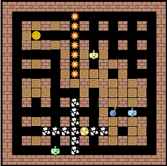

# Arcade Reinforcement Learning

In this project Reinforcement Learning is used to train an agent in playing a version of the "Bomberman" arcade game.

The framework of the game is taken from https://github.com/ukoethe/bomberman_rl. For a detailed explanation of the framework refer to the repository referenced above or the project .

The trained agent is located at `agent_code/null_agent`. The trained model is tracked using .

We use random forests to learn a Q-Table with hand-crafted features, such as a one-hot feature indicating the direction to the nearest coin, or a feature indicating if the agent could escape a bomb placed at its current location.

We also include the last 4 moves of the agent as numerical features to detect repeating patterns.

We extracted and analyze the relative feature importance for individual forests (actions).

In training, we use decaying epsilon-greedy exploration. Individual forests are trained on the full memory of states in which its corresponding action was performed (no cut-off for number of training instances).

Reward structure is divided into "local" and "global" rewards. Local rewards are small and tailored to individual actions or features, e.g. moving to safety is both a feature and a reward. Global rewards relate to the game score.

For more information take a look at the .
